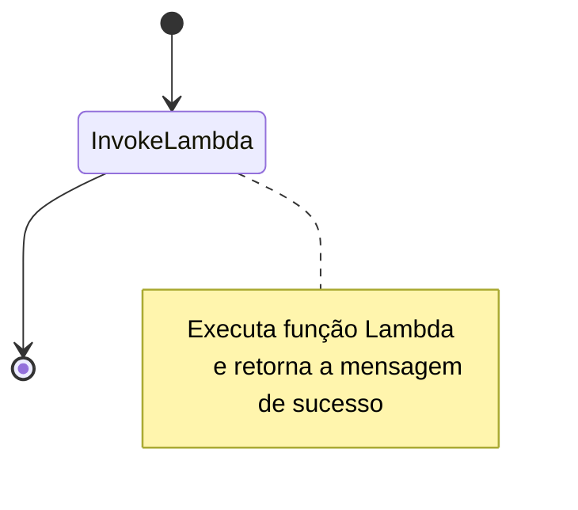

# 🚀 Desafio AWS Step Functions — DIO - BOOTCAMP SANTANDER CODE GIRLS 2025

## 🧠 Descrição do Desafio
Este laboratório tem como objetivo consolidar meus workflows automatizados utilizando **AWS Step Functions**.  
O resultado é um repositório organizado com anotações, prints e códigos utilizados durante a prática — servindo como material de estudo e referência para futuras implementações na AWS.

---

## 🎯 Objetivos de Aprendizagem
Ao concluir este desafio, fui capaz de:

✅ Aplicar os conceitos aprendidos em um ambiente prático  
✅ Documentar processos técnicos de forma clara e estruturada  
✅ Utilizar o GitHub como ferramenta para compartilhar documentação técnica  

---

## ⚙️ Tecnologias e Serviços Utilizados
- **AWS Step Functions** — para orquestrar o fluxo do processo  
- **AWS Lambda** — para executar a função principal  
- **AWS IAM** — para gerenciar permissões e roles  
- **AWS CloudWatch** — para monitorar logs da execução  
- **GitHub** — para versionamento e documentação  

---

## 🧩 Arquitetura do Workflow

O fluxo criado é simples:  
1️⃣ A Step Function inicia a execução.  
2️⃣ Ela chama uma função **AWS Lambda**.  
3️⃣ A Lambda processa a entrada e retorna uma mensagem personalizada.  
4️⃣ A execução finaliza com sucesso.

### 🔁 Representação visual:

---
### 🧰 Recursos Criados
| #Recurso	               |                  #Nome	               |                         #Descrição                        |
| ------------------------ | ------------------------------------- | ---------------------------------------------------------- |
| Lambda Function	         |        lab-stepfn-sample-lambda	     |      Função responsável por retornar mensagem personalizada |
| Step Function	           |    lab-stepfn-sample-state-machine	   |            Orquestra o fluxo que chama a Lambda |
| IAM Role	               |         lab-stepfn-exec-role	         |    Permite que o Step Functions invoque a Lambda e gere logs |
| Região AWS	             |               us-east-1 	             |             Região onde o projeto foi implementado |

---
### 🪄 Passo a Passo da Implementação

# 🧩 1. Criar a Função Lambda

1. No console da AWS, acesse Lambda > Criar função.
2. Selecione Author from scratch.
3. Nome: `lab-stepfn-sample-lambda`
4. Runtime: `Python 3.11`
5. Permissões: crie uma nova role básica (`lab-lambda-exec-role`)
6. Substitua o código padrão pelo seguinte:
  ```
    def lambda_handler(event, context):
    # event: dados que o Step Functions envia
    name = event.get("name", "Mundo")
    message = f"Olá, {name} — sua tarefa foi executada com sucesso!"
    # retornar algo que a máquina de estados pode usar depois
    return {"message": message, "inputReceived": event}
  ```
7. Clique em Deploy (Implantar).
---
# 🔐 2. Criar Role IAM para o Step Functions 

  1. Vá para IAM > Roles > Create Role
  2. Trusted entity: Step Functions
  3. Adicione uma policy com permissões básicas:
     ```
     {
      "Version": "2012-10-17",
      "Statement": [
        {
          "Effect": "Allow",
          "Action": [
            "lambda:InvokeFunction"
          ],
          "Resource": "*"
        },
        {
          "Effect": "Allow",
          "Action": [
      "logs:CreateLogGroup",
     "logs:CreateLogStream",
     "logs:PutLogEvents"
     ],
          "Resource": "*"
        }
      ]
     }
     ```
4. Nome da Role: `lab-stepfn-exec-role`
5. Crie a Role.
---
# ⚙️ 3. Criar a Step Function

  1. No console da AWS, vá em Step Functions > Create state machine
  2. Escolha Author with visual workflow
  3. Tipo: Standard
  4. Nome: `lab-stepfn-sample-state-machine`
  5. Adicione um Task que invoca a Lambda `lab-stepfn-sample-lambda`
  6. Atribua a role criada: `lab-stepfn-exec-role`
  7. Salve.
  ```
  {
  "Comment": "A description of my state machine",
  "StartAt": "Lambda Invoke",
  "States": {
    "Lambda Invoke": {
      "Type": "Task",
      "Resource": "arn:aws:states:::lambda:invoke",
      "Output": "",
      "Arguments": {
        "FunctionName": "arn:aws:lambda:us-east-1:000000000000:function:lab-stepfn-sample-lambda:$LATEST",
        "Payload": ""
      },
      "Retry": [
        {
          "ErrorEquals": [
            "Lambda.ServiceException",
            "Lambda.AWSLambdaException",
            "Lambda.SdkClientException",
            "Lambda.TooManyRequestsException"
          ],
          "IntervalSeconds": 1,
          "MaxAttempts": 3,
          "BackoffRate": 2,
          "JitterStrategy": "FULL"
        }
      ],
      "Next": "Êxito"
    },
    "Êxito": {
      "Type": "Succeed"
    }
  },
  "QueryLanguage": "JSONata"
}
 ```
---
# 🧪 4. Executar o Workflow

  1. Clique em Start Execution
  2. Insira o JSON de entrada:
     ```
      {
         "name": "Adriana"
      }
     ```
  3. Clique em Start execution
  4. Veja o resultado do passo `InvokeLambda`:
     ```
     {
         "message": "Olá, Adriana - sua tarefa foi executada com sucesso!",
         "inputReceived": {
         "name": "Adriana"
         }
      }
     ```
---
# 🖼️ Capturas de Tela

Todas as capturas foram salvas na pasta ´/images`:
  - images/create-lambda.png — Criação da função Lambda
  - images/create-role.png — Criação da Role IAM
  - images/create-step-function.png — Criação da Step Function
  - images/execution-result.png — Execução bem-sucedida
---
# 💡 Insights e Aprendizados

# ✨ Com este desafio, aprendi:
 - A criar funções Lambda com Python diretamente no console.
 - A construir workflows visuais e automatizados com AWS Step Functions.
 - A conceder permissões seguras via IAM (aprendendo o princípio do menor privilégio).
 - A documentar projetos técnicos e compartilhar no GitHub de forma organizada.

# 🧹 Limpeza de Recursos

Para evitar custos após o laboratório:
  - Exclua a Step Function
  - Exclua a Função Lambda
  - Exclua as Roles IAM criadas

# 📚 Referências

📘 Documentação AWS Step Functions: (https://docs.aws.amazon.com/step-functions/latest/dg/welcome.html)
📘 Documentação AWS Lambda: (https://docs.aws.amazon.com/lambda/latest/dg/welcome.html)
📘 GitHub Docs – Markdown Guide: (https://docs.github.com/en/get-started/writing-on-github)

# ✨ Autor

- 👩‍💻 Adriana Almeida
- 📍 Rio de Janeiro - Brasil


# ✅ Status do Projeto
    🟢 Concluído com sucesso.
    Repositório criado para fins de aprendizado — parte do desafio AWS Step Functions (BOOTCAMP SANTANDER CODE GIRLS 2025 | DIO).


     


    

